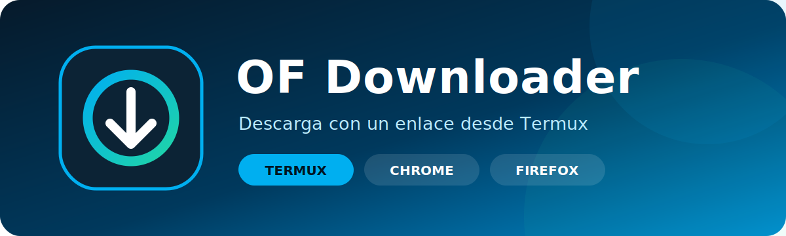

<p align="center">
  
</p>

<p align="center">
  <strong>Menú sencillo para Linux y Termux que ayuda a respaldar contenido al que tu cuenta ya tiene acceso.</strong>
</p>

<p align="center">
  <a href="#instalación-rápida-en-termux"><strong>Instalar en Termux</strong></a>
  ·
  <a href="#instalación-rápida-en-linux">Instalar en Linux</a>
  ·
  <a href="#instalación-rápida-en-windows">Instalar en Windows</a>
  ·
  <a href="#extensiones-para-chrome-y-firefox">Extensiones</a>
  ·
  <a href="#conectar-la-cuenta">Conectar cuenta</a>
</p>

> [!IMPORTANT]
> Este repositorio y las descargas de extensiones son privados. Para instalarlos
> debes iniciar sesión en GitHub con una cuenta autorizada.

OF Downloader no evita suscripciones, pagos ni restricciones. Solo organiza la
descarga de contenido disponible para tu propia cuenta. Úsalo respetando las
condiciones del servicio, los derechos de los creadores y la ley aplicable.

## Qué hace

- Abre un menú claro en Termux o en una terminal Linux.
- En Windows abre interfaz gráfica y también comando `of` en terminal.
- Descarga una publicación con un enlace.
- Descarga un perfil con la opción **2. Descargar todo un usuario**.
- Importa un archivo `OFBackup-auth.json` creado por la extensión del navegador.
- Prueba si la cookie funciona antes de descargar.
- Muestra barra de progreso, resumen y errores en pantalla.
- Guarda logs visibles en la carpeta de descargas para que no tengas que entrar
  a carpetas privadas de Termux.
- Avisa cuando hay actualización del repositorio y permite actualizar desde el menú.

## Instalación rápida en Termux

Instala Termux desde F-Droid o desde las publicaciones oficiales de GitHub. No
uses la versión vieja de Google Play.

También instala **Termux:API** desde la misma fuente que Termux. Sirve para abrir
el selector de archivos de Android.

Copia esto en Termux:

```bash
pkg update -y && pkg install -y git gh
gh auth login
gh repo clone tacosandtypescript-debug/of-downloader
cd of-downloader
bash instalar-termux.sh
```

La primera instalación puede tardar varios minutos porque prepara Debian,
Python, FFmpeg y OF-Scraper. Si algo falla, el instalador se detiene y muestra el
error.

Cuando termine, abre la app con:

```bash
of
```

Carpetas principales en Termux:

- Descargas: `/root/storage/downloads/OFBackup`
- Configuración privada: `/root/.config/ofbackup`
- Log de última descarga: `/root/storage/downloads/OFBackup/ultima-descarga.log`
- Log de prueba de perfil: `/root/storage/downloads/OFBackup/prueba-perfil.log`

## Instalación rápida en Linux

Copia esto en la terminal:

```bash
sudo apt update && sudo apt install -y git gh
gh auth login
gh repo clone tacosandtypescript-debug/of-downloader
cd of-downloader
bash instalar-linux.sh
```

Al terminar puedes abrirlo con:

```bash
of
```

También queda disponible:

```bash
of-downloader
```

Carpetas principales en Linux:

- Descargas: `~/Downloads/OFDownloader`
- Configuración privada: `~/.config/ofbackup`
- Configuración interna de OF-Scraper: `~/.config/ofscraper`

## Instalación rápida en Windows

Requisitos:

- Windows 10 u 11.
- Python 3.11 o 3.12. Si no está instalado, el instalador intentará poner
  Python 3.12 automáticamente con `winget`.
- GitHub CLI si vas a clonar el repo privado desde Windows.

No uses Python 3.13 en Windows para esta app: algunas dependencias de OF-Scraper
pueden intentar compilarse y pedir Microsoft Visual C++ Build Tools. Python 3.12
evita ese problema en instalaciones normales.

Instalación desde PowerShell:

Instalador:
https://github.com/tacosandtypescript-debug/of-downloader/blob/main/instalar-windows.ps1

```powershell
gh auth login
gh repo clone tacosandtypescript-debug/of-downloader
cd of-downloader
powershell -NoProfile -ExecutionPolicy Bypass -File .\instalar-windows.ps1
```

Si ya tienes `gh` conectado y quieres hacerlo en un solo bloque:

```powershell
gh repo clone tacosandtypescript-debug/of-downloader "$env:USERPROFILE\of-downloader"; cd "$env:USERPROFILE\of-downloader"; powershell -NoProfile -ExecutionPolicy Bypass -File .\instalar-windows.ps1
```

El instalador no necesita permisos de administrador. Crea:

- Entorno privado de Python en `.venv`.
- Comando `of` para terminal.
- Comando `of-downloader` para abrir la interfaz gráfica.
- Acceso **OF Downloader** en el menú Inicio.
- Carpeta de descargas en `%USERPROFILE%\Downloads\OFDownloader`.

Abre una terminal nueva y ejecuta:

```bat
of
```

Para abrir la ventana gráfica:

```bat
of-downloader
```

Para cargar la cookie exportada desde la extensión:

```bat
of importar "%USERPROFILE%\Downloads\OFBackup-auth.json"
of probar
```

Si el archivo se llama exactamente `OFBackup-auth.json` y está en Descargas,
también funciona:

```bat
of importar
```

FFmpeg es recomendable para videos. Si no está instalado, el instalador lo avisa.
Puedes intentar instalarlo con:

```powershell
.\instalar-windows.ps1 -InstallFFmpeg
```

## Extensiones para Chrome y Firefox

Las extensiones viven en un repositorio separado:

https://github.com/tacosandtypescript-debug/of-downloader-browser-extensions

Descargas rápidas:

- Chrome / Chromium:
  https://github.com/tacosandtypescript-debug/of-downloader-browser-extensions/releases/latest/download/of_downloader_exporter-chrome-1.0.3.zip
- Firefox:
  https://github.com/tacosandtypescript-debug/of-downloader-browser-extensions/releases/latest/download/of_downloader_exporter-firefox-1.0.4.zip

### Instalar la extensión en Chrome

Chrome no permite instalar extensiones locales con un solo clic si no están en la
Chrome Web Store. Por eso se carga descomprimida:

1. Descarga el ZIP de Chrome.
2. Descomprímelo.
3. Abre `chrome://extensions`.
4. Activa **Modo de desarrollador**.
5. Pulsa **Cargar descomprimida**.
6. Selecciona la carpeta donde está `manifest.json`.
7. Fija **OF Downloader Exporter** desde el icono de extensiones.

Si ves “Falta el archivo de manifiesto”, seleccionaste la carpeta equivocada.
Entra una carpeta más adentro hasta ver `manifest.json`.

### Instalar la extensión en Firefox

Descarga el ZIP de Firefox desde las releases del repositorio de extensiones.
Si se usa como instalación local temporal, Firefox puede pedir cargarla de nuevo
después de reiniciar. Para uso diario conviene usar el paquete firmado desde
Mozilla Add-ons si ya fue generado para tu cuenta.

## Conectar la cuenta

El método recomendado es exportar `OFBackup-auth.json` desde el navegador y
cargarlo en Termux o Linux.

### 1. Exportar desde el navegador

1. Abre `https://onlyfans.com` en Chrome o Firefox.
2. Inicia sesión.
3. Recarga la página.
4. Pulsa el icono **OF Downloader Exporter**.
5. Pulsa **Exportar para OF Downloader**.
6. Guarda `OFBackup-auth.json`.

La extensión procesa todo localmente. No usa servidores propios, telemetría ni
portapapeles.

### 2. Cargar el archivo

En Termux, si el archivo está en Descargas:

```bash
of importar "$HOME/storage/downloads/OFBackup-auth.json"
```

O abre el selector Android:

```bash
of importar
```

En Linux:

```bash
of importar ~/Downloads/OFBackup-auth.json
```

La app solo conserva estos 4 datos:

- `sess`
- `auth_id`
- `x-bc`
- `User-Agent`

El resto del JSON se descarta.

### 3. Probar que funciona

```bash
of probar
```

Resultado esperado:

```text
✓ COOKIE VÁLIDA
OnlyFans aceptó la sesión. OF Downloader está listo para descargar.
```

Después borra `OFBackup-auth.json` de Descargas.

## Descargar contenido

Abre el menú:

```bash
of
```

Opciones principales:

- **1. Descargar una publicación con un enlace**
- **2. Descargar todo un usuario**
- **3. Conectar mi cuenta o renovar el acceso**
- **5. Ver diagnóstico**
- **7. Probar si la cookie funciona**
- **8. Actualizar OF Downloader y reiniciar**

Comandos directos:

```bash
of "https://onlyfans.com/ID/usuario"
of usuario NOMBRE
```

Para probar si el perfil se detecta bien antes de descargar:

```bash
of probar-perfil NOMBRE
```

Ese comando deja el detalle en:

```text
/root/storage/downloads/OFBackup/prueba-perfil.log
```

## Si la opción 2 no detecta contenido en Termux

Prueba esto en orden:

```bash
of probar
of probar-perfil NOMBRE
```

Si `of probar` dice que la cookie es inválida, vuelve a exportar el JSON desde
el navegador. `sess`, `auth_id`, `x-bc` y `User-Agent` deben salir de la misma
sesión.

Si `of probar` funciona pero `of probar-perfil` no encuentra contenido, revisa:

```bash
tail -n 80 /root/storage/downloads/OFBackup/prueba-perfil.log
tail -n 80 /root/storage/downloads/OFBackup/ultima-descarga.log
```

La descarga de perfil en Termux fuerza un reescaneo completo para evitar caché
vacía o antigua.

## Actualizar

Desde el menú:

```bash
of
```

Elige:

```text
8. Actualizar OF Downloader y reiniciar
```

O usa el comando directo:

```bash
of actualizar-app
```

Actualización manual:

```bash
cd ~/of-downloader
git pull
bash instalar-termux.sh
```

En Linux:

```bash
cd ~/of-downloader
git pull
bash instalar-linux.sh
```

En Windows:

```bat
cd ruta\al\of-downloader
git pull
powershell -NoProfile -ExecutionPolicy Bypass -File .\instalar-windows.ps1
```

## Seguridad

- No pegues cookies en chats, issues, capturas ni comandos públicos.
- No publiques `OFBackup-auth.json`, `config.json` ni `auth.json`.
- Borra `OFBackup-auth.json` después de importarlo.
- Si compartiste una cookie por accidente, cierra esa sesión en el navegador y
  genera un JSON nuevo.
- Usa solo contenido al que tu cuenta tenga acceso legítimo.

## Desarrollo

Estructura principal del repo:

```text
ofbackup_cli.py              Menú de terminal para Termux, Linux y Windows
app.py                       Interfaz gráfica de escritorio
instalar-termux.sh           Instalador Android/Termux
instalar-linux.sh            Instalador Linux de escritorio
instalar-windows.ps1         Instalador Windows por PowerShell
ofbackup                     Launcher Termux
of-downloader-linux          Launcher Linux
of-windows.cmd               Launcher terminal Windows
of-downloader-windows.cmd    Launcher gráfico Windows
tests/                       Pruebas automáticas
docs/                        Recursos visuales del README
```

Ejecutar pruebas:

```bash
python -m unittest discover -s tests
```

OF-Scraper se instala en un entorno privado de la app. La versión fijada vive en
`ofbackup_cli.py`.
