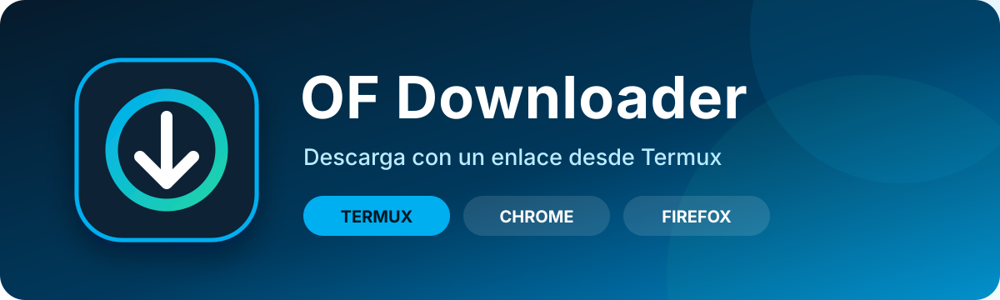

<p align="center">
  
</p>

<p align="center">
  <strong>OF Downloader · menú de terminal para Termux, Linux y Windows.</strong>
</p>

<p align="center">
  <a href="#instalación-rápida">Instalación</a>
  ·
  <a href="#dashboard-web-solo-pc">Dashboard</a>
  ·
  <a href="#extensión-del-navegador">Extensión</a>
  ·
  <a href="#conectar-la-cuenta">Conectar cuenta</a>
  ·
  <a href="#google-drive">Google Drive</a>
  ·
  <a href="#actualizar">Actualizar</a>
</p>

> [!IMPORTANT]
> OF Downloader no evita suscripciones, pagos ni restricciones. Solo organiza
> descargas de contenido disponible para tu propia cuenta. Úsalo respetando los
> derechos de los creadores, las condiciones del servicio y la ley aplicable.

## Qué hace

- Abre un menú simple con el comando `of`.
- Funciona en Termux, Linux y Windows.
- En Linux y Windows incluye un dashboard local para el navegador.
- Conecta la cuenta usando la extensión `OF Downloader Exporter`.
- Puede recibir la cookie desde la extensión por red local.
- Lista perfiles suscritos activos cuando OnlyFans los devuelve.
- Descarga perfiles completos por usuario/enlace y publicaciones por enlace.
- Incluye una variante nativa para a-Shell/iOS basada únicamente en Python
  estándar, con menú interactivo y preparación local del motor.
- Muestra progreso, resumen y logs visibles.
- Puede subir archivos nuevos a Google Drive usando `rclone`.
- Permite actualizar la app desde el menú.

Versión actual del CLI multiplataforma: `2.17.8`
Motor nativo para a-Shell/iOS: `2.18.0`

### Novedades de 2.18.0 (iOS/a-Shell)

- El menú iOS permanece abierto entre operaciones y añade `of compilar` para
  preparar el bytecode y comprobar el almacenamiento local.
- El instalador iOS usa descargas temporales, valida cada archivo y ejecuta una
  comprobación de compilación dentro de a-Shell.

### Novedades de 2.17.8

- CLI multiplataforma con menú de descargas y selección de suscripciones.
- Importación automática de `OFBackup-auth.json` desde las rutas habituales.

### Novedades de 2.17.7

- Nueva variante nativa para a-Shell en iOS, sin SSH ni Termux remoto.
- CLI Python estándar desde cero con `of`, importación segura, firma de API, perfiles y descarga secuencial.
- El contenido bloqueado o DRM se detecta y se omite.

Consulta [`ios/README.md`](ios/README.md) para instalarla y conocer sus límites.

### Novedades de 2.17.6

- La tarjeta activa muestra `X de Y archivos` y el archivo actual.
- La barra principal representa el progreso total del perfil.

### Novedades de 2.17.5

- La cola muestra la fase real y el archivo actual de la descarga.
- Se distinguen inicio, detección, descarga, finalización y error.

### Novedades de 2.17.4

- El actualizador copia también subdirectorios nuevos como `backend/queue`.
- Se valida que la instalación no quede incompleta antes de abrir el dashboard.

### Novedades de 2.17.3

- Progreso de la cola conectado al dashboard mediante eventos SSE.
- Actualizaciones en vivo de estados sin depender únicamente del sondeo.

### Novedades de 2.17.2

- Cola del dashboard separada visualmente de la creación de descargas.
- Persistencia y eventos de cola preparados para progreso en vivo.

### Novedades de 2.17.1

- Corrección de la cola del dashboard en Linux y Windows.
- Notificaciones de actualización también en Windows.
- Carga inicial de perfiles, logs visibles y serialización segura de trabajos.
- Selector de perfil/publicación y destino de descarga conectados.

### Novedades de 2.17.0

- Dashboard web integrado para Linux y Windows con la opción `[13]` del menú.
- Servidor ligado exclusivamente a `127.0.0.1`, token temporal por sesión y
  protección contra peticiones externas.
- Importación real de `OFBackup-auth.json` mediante selección o arrastrar y soltar.
- Prueba de sesión, estado de cuenta, perfiles suscritos y carpeta de descargas
  conectados al backend existente.
- Cola secuencial de descargas desde el navegador con pausa, reanudación y
  cancelación del proceso activo.
- El dashboard no aparece en Termux y bloquea navegadores móviles o tablets.

### Novedades de 2.16.4

- Evita mostrar códigos ANSI crudos en el PowerShell clásico de Windows.
- Mantiene colores en Windows Terminal, PowerShell 7, Linux y Termux.

### Novedades de 2.16.3

- FFmpeg y rclone son opcionales durante la instalación de Windows.
- Si winget no puede instalarlos, el instalador termina correctamente y muestra
  qué funciones quedan desactivadas.

### Novedades de 2.16.2

- `qrencode` pasa a ser opcional en Termux; no detiene la instalación si no existe.
- `rclone` y `termux-api` siguen tratándose como herramientas independientes.

### Novedades de 2.16.1

- Corrección del actualizador de Termux para instalar `backend/` y `frontend/`.
- Verificación de componentes antes de reiniciar el menú.

### Novedades de 2.16.0

- Barra de progreso en vivo con bloques de color `▰/▱`.
- Contadores reales de fotos, videos y omitidos leídos del motor.
- Velocidad y tiempo estimado (ETA) durante perfiles grandes.
- Colores automáticos en PowerShell, Linux y Termux, con respaldo ASCII.

## Links rápidos

- App principal: https://github.com/tacosandtypescript-debug/of-downloader
- Extensiones: https://github.com/tacosandtypescript-debug/of-downloader-browser-extensions
- Descargar ZIP del repo: https://github.com/tacosandtypescript-debug/of-downloader/archive/refs/heads/main.zip

## Instalación rápida

### Termux / Android

Instala Termux desde F-Droid o GitHub. No uses la versión antigua de Google Play.

```bash
pkg update -y
pkg install -y git
git clone https://github.com/tacosandtypescript-debug/of-downloader.git
cd of-downloader
bash instalar-termux.sh
of
```

### Linux

```bash
sudo apt update
sudo apt install -y git
git clone https://github.com/tacosandtypescript-debug/of-downloader.git
cd of-downloader
bash instalar-linux.sh
of
```

### Windows

Abre PowerShell:

```powershell
winget install -e --id Git.Git
git clone https://github.com/tacosandtypescript-debug/of-downloader.git "$env:USERPROFILE\of-downloader"
cd "$env:USERPROFILE\of-downloader"
powershell -NoProfile -ExecutionPolicy Bypass -File .\instalar-windows.ps1
```

Abre una terminal nueva y ejecuta:

```powershell
of
```

El instalador de Windows intenta preparar Python 3.12, FFmpeg y rclone con
`winget`. No uses Python 3.13 para esta app en Windows.

## Dashboard web (solo PC)

El dashboard está disponible únicamente en Linux y Windows. No se muestra en
Termux y el frontend bloquea navegadores móviles o tablets.

Desde el menú ejecuta `of` y elige:

```text
[13] Abrir dashboard en el navegador
```

También puede abrirse directamente:

```bash
of dashboard
```

El servidor escucha solo en `127.0.0.1` y abre una dirección similar a
`http://127.0.0.1:8766`. Si ese puerto está ocupado, prueba automáticamente los
siguientes. El terminal debe permanecer abierto mientras se usa el panel.

Desde el dashboard se puede:

- Cargar y guardar `OFBackup-auth.json` con arrastrar y soltar.
- Probar la sesión sin mostrar los valores privados.
- Consultar las suscripciones activas.
- Añadir perfiles, enlaces o IDs a una cola secuencial.
- Pausar, reanudar o cancelar la descarga activa.
- Abrir la carpeta configurada y consultar el estado de Google Drive.

Las credenciales nunca se devuelven al navegador después de guardarlas. El
servidor conserva únicamente `sess`, `auth_id`, `x-bc` y `User-Agent` en la
configuración privada que ya usa OF-Scraper.

## Descargar un perfil completo

La descarga de perfil recorre todo el contenido que tu cuenta puede consultar:
Timeline, archivados, fijados, historias, streams, perfil y compras. Usa todos
los posts, fuerza el reescaneo y desactiva las cachés del motor para evitar que
una ejecución anterior o incompleta oculte contenido.

Durante la descarga se muestra una barra viva con el estado y el contador
`Total descargado/total`. En perfiles completos puedes pulsar `P` y Enter para
pausar OF-Scraper y sus procesos hijos, cambiar de red y pulsar `R` y Enter para
reanudar. Si el motor no informa un total, se muestra el total descargado sin
inventar una cantidad restante.

Estos controles funcionan dentro de la CLI en Linux y Termux; el lanzador deja
el teclado al menú y Python toma el control solo durante la descarga. OF-Scraper
no puede ejecutarse dentro de a-Shell, pero el repositorio incluye un motor iOS
nativo y reducido en `ios/`, basado únicamente en Python estándar. Ese motor no
usa SSH ni Termux y descarga secuencialmente los medios directos accesibles.

Desde el menú elige `[2] Descargar perfil por usuario o enlace`, o ejecuta:

```bash
of usuario NOMBRE
of "https://onlyfans.com/NOMBRE"
```

La opción `[1]` permite elegir un perfil de tus suscripciones y muestra un
conteo previo antes de confirmar la descarga completa. Las emisiones en vivo no
se incluyen porque no son contenido histórico descargable. Los archivos ya
existentes se conservan y el resumen final distingue archivos nuevos, omitidos
y fallos.

La deteccion previa tambien consulta el area `Purchased` para identificar
contenido comprado o bloqueado cuando OnlyFans lo entrega a la sesion. Si solo
devuelve los totales del perfil, veras "medios declarados" y el detalle de
accesibles/bloqueados quedara como "no informado"; no significa que el perfil
este vacio.

## Extensión del navegador

La extensión se usa para conectar tu cuenta sin pegar cookies manualmente.

Descargas:

- Chrome / Chromium:
  https://github.com/tacosandtypescript-debug/of-downloader-browser-extensions/raw/main/artifacts/of_downloader_exporter-chrome-1.0.6.zip
- Firefox:
  https://github.com/tacosandtypescript-debug/of-downloader-browser-extensions/raw/main/artifacts/of_downloader_exporter-firefox-1.0.7.zip

### Instalar en Chrome / Chromium

1. Descarga el ZIP de Chrome.
2. Descomprime el ZIP.
3. Abre `chrome://extensions`.
4. Activa **Modo de desarrollador**.
5. Pulsa **Cargar descomprimida**.
6. Selecciona la carpeta que contiene `manifest.json`.

Si Chrome dice que falta el manifiesto, seleccionaste la carpeta equivocada.
Entra una carpeta más adentro hasta ver `manifest.json`.

### Instalar en Firefox

Usa el ZIP de Firefox o el complemento firmado desde Mozilla Add-ons si ya está
aprobado en tu cuenta.

## Conectar la cuenta

Flujo recomendado:

1. Abre OF Downloader:

```bash
of
```

2. Elige:

```text
[11] Recibir cookie desde extension
```

3. Abre OnlyFans en el navegador donde instalaste la extensión.
4. Abre la extensión `OF Downloader Exporter`.
5. Pulsa **Buscar OF Downloader en mi red**.
6. Si encuentra el celular/PC, pulsa **Enviar a OF Downloader**.
7. Comprueba:

```bash
of probar
```

Respaldo manual si la búsqueda no funciona:

```bash
of recibir-cookie
of recibir-cookie --qr
```

Ese modo muestra enlace rápido, URL local y código temporal. El QR o enlace no
contiene la cookie; solo sirve para vincular la extensión con OF Downloader. La
cookie se envía aparte por red local y el servidor se cierra después de recibir.

## Menú principal

```text
DESCARGAS
[1] Elegir perfil de mis suscripciones
[2] Descargar perfil por usuario o enlace
[3] Descargar publicación por enlace

MI CUENTA
[4] Conectar o renovar acceso
[5] Probar acceso

HERRAMIENTAS
[6] Cambiar carpeta de descargas
[7] Ver diagnóstico
[8] Actualizar OF Downloader y reiniciar
[9] Actualizar motor de descarga
[10] Google Drive

EXTENSION Y COOKIE
[11] Recibir cookie desde extension
[12] Descargar extension para cookie  (Windows y Linux)
[0] Salir
```

## Comandos útiles

```bash
of
of perfiles
of usuario NOMBRE
of "https://onlyfans.com/..."
of probar
of diagnostico
of actualizar-app
of recibir-cookie
of recibir-cookie --qr
```

`of probar` guarda el diagnóstico técnico de cada intento en
`~/ofbackup-auth-test.log`. El registro incluye código HTTP, duración,
arquitectura, entorno de red y la salida de OF-Scraper con credenciales
redactadas. Para compartirlo:

```bash
tail -n 120 ~/ofbackup-auth-test.log
```

## Google Drive

OF Downloader usa `rclone` para subir a Google Drive.

```bash
of drive instalar
of drive configurar
of drive activar
of drive estado
of drive subir
of drive pendientes
of drive limpiar
of drive limpiar todo
```

Por defecto:

- Remote: `gdrive`
- Carpeta en Drive: `OFDownloader`
- No borra archivos locales después de subir.
- Si falla una subida, queda en pendientes.

En Termux, `rclone` debe existir dentro del Debian interno. Si falta:

```bash
proot-distro login --shared-home ofbackup-debian -- apt-get update
proot-distro login --shared-home ofbackup-debian -- apt-get install -y rclone qrencode
```

## Rutas importantes

### Termux

- Repo: `~/of-downloader`
- Descargas: `/root/storage/downloads/OFBackup`
- Config privada: `/root/.config/ofbackup`
- Config OF-Scraper: `/root/.config/ofscraper`
- Logs visibles: `/root/storage/downloads/OFBackup`

### Linux

- Repo: `~/of-downloader`
- Descargas: `~/Downloads/OFDownloader`
- Config privada: `~/.config/ofbackup`
- Config OF-Scraper: `~/.config/ofscraper`

### Windows

- Repo: `%USERPROFILE%\of-downloader`
- Descargas: `%USERPROFILE%\Downloads\OFDownloader`
- Config privada: `%USERPROFILE%\.config\ofbackup`
- Config OF-Scraper: `%USERPROFILE%\.config\ofscraper`
- Comandos: `%LOCALAPPDATA%\Programs\OFDownloader\bin`

## Actualizar

Desde el menú:

```text
[8] Actualizar OF Downloader y reiniciar
```

Manual:

```bash
cd ~/of-downloader
git pull --ff-only origin main
bash instalar-termux.sh
```

Si instalaste con `curl | sh` y no tienes `~/of-downloader`, usa el actualizador
incremental. Descarga el código de `main`, conserva la cookie, perfiles,
configuración y descargas, y solo ejecuta `pip` si cambió
`requirements-termux.txt`:

```bash
curl -fsSL https://raw.githubusercontent.com/tacosandtypescript-debug/of-downloader/main/actualizar-termux.sh | bash
```

Este comando no reinstala Debian, Python ni FFmpeg.

El actualizador guarda un registro en `~/ofbackup-actualizacion.log`. Si algo
falla, comparte solo las últimas líneas de ese archivo (nunca el JSON ni la
cookie):

```bash
tail -n 100 ~/ofbackup-actualizacion.log
```

### Aplicación Android Companion

El módulo `android/` contiene una aplicación Android independiente para iniciar
sesión dentro de su propio WebView y exportar manualmente un
`OFBackup-auth.json` compatible con OF Downloader. La aplicación no lee las
cookies privadas de Chrome ni de otras aplicaciones.

Para compilar el APK de prueba desde un entorno con Android SDK y Gradle:

```bash
gradle :android:assembleDebug
```

Después instala `android/build/outputs/apk/debug/android-debug.apk`, inicia
sesión, pulsa **Generar archivo**, guarda el JSON mediante el selector de
Android e impórtalo con `of importar`.

Para enviarlo mediante un bot de Telegram, crea el bot en `@BotFather`, inicia
una conversación con él y ejecuta el script sin poner el token en el historial
del shell:

```bash
export TELEGRAM_BOT_TOKEN='TOKEN_NUEVO_DEL_BOT'
export TELEGRAM_CHAT_ID='TU_CHAT_ID'
python3 scripts/send_apk_telegram.py
unset TELEGRAM_BOT_TOKEN TELEGRAM_CHAT_ID
```

También puedes pedirlos de forma interactiva; el token se escribe oculto:

```bash
python3 scripts/send_apk_telegram.py --interactive
```

En Linux cambia el último comando por:

```bash
bash instalar-linux.sh
```

En Windows:

```powershell
cd "$env:USERPROFILE\of-downloader"
git pull --ff-only origin main
powershell -NoProfile -ExecutionPolicy Bypass -File .\instalar-windows.ps1
```

## Reinstalar limpio

### Termux

```bash
rm -rf ~/of-downloader
git clone https://github.com/tacosandtypescript-debug/of-downloader.git
cd of-downloader
bash instalar-termux.sh
```

Para borrar también configuración/cookies:

```bash
rm -rf /root/.config/ofbackup /root/.config/ofscraper
```

### Windows

```powershell
Remove-Item -Recurse -Force "$env:USERPROFILE\of-downloader"
Remove-Item -Recurse -Force "$env:LOCALAPPDATA\Programs\OFDownloader"
git clone https://github.com/tacosandtypescript-debug/of-downloader.git "$env:USERPROFILE\of-downloader"
cd "$env:USERPROFILE\of-downloader"
powershell -NoProfile -ExecutionPolicy Bypass -File .\instalar-windows.ps1
```

## Seguridad

- No pegues cookies en chats, issues ni capturas.
- No publiques `OFBackup-auth.json`, `auth.json` ni `config.json`.
- El QR/enlace de conexión no contiene la cookie.
- La extensión no guarda la cookie.
- Si una cookie se filtró, cierra esa sesión en el navegador y genera otra.
- Usa solo contenido al que tu cuenta tenga acceso legítimo.

## Desarrollo

```bash
python -m unittest discover -s tests
```

Archivos principales:

```text
ofbackup_cli.py              Menú terminal
instalar-termux.sh           Instalador Termux
instalar-linux.sh            Instalador Linux
instalar-windows.ps1         Instalador Windows
ofbackup                     Launcher Termux
of-downloader-linux          Launcher Linux
of-windows.cmd               Launcher Windows terminal
tests/                       Pruebas automáticas
docs/                        Recursos visuales
```
